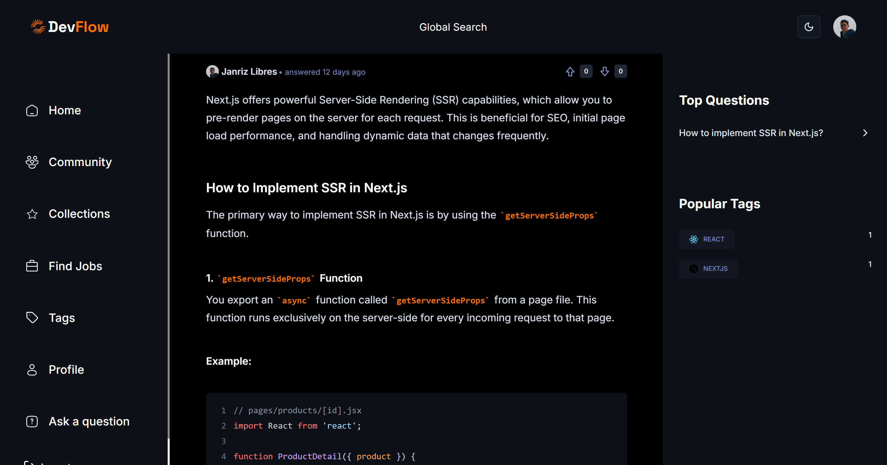

# FlowStack


[](http://devflow-clone-app.vercel.app/)
[](LICENSE)



## 🌐 Demo

Here is a working live demo: http://devflow-clone-app.vercel.app/

## 📝 Description

FlowStack is a modern, community-driven platform designed as a StackOverflow clone. It empowers developers to ask questions, share knowledge, and collaborate on solutions. The platform offers robust features for posting questions, comprehensive search capabilities, commenting on discussions, and analytics to track engagement. It is built with a focus on a seamless user experience and secure authentication powered by NextAuth.js.

## 📖 Table of Contents

- [🌐 Demo](#-demo)
- [📝 Description](#-description)
- [✨ Features](#-features)
- [💻 Technologies Used](#️-technologies-used)
- [🛠️ Setup Project](#-setup-project)
  - [🍴 Prerequisites](#-prerequisites)
  - [🚀 Install Project](#-install-project)
- [🤝 Contributing and Support](#-contributing-and-support)
  - [⚒️ How to Contribute](#️-how-to-contribute)
  - [📩 Bug Report](#-bug-report)
- [📜 Credits](#-credits)
- [📞 Contact Me](#-contact-me)
- [📋 License](#-license)

## ✨ Features

👉 **Ask and Answer Questions**: Users can post new questions and provide detailed answers.

👉 **Search Functionality**: Efficiently search for questions and answers using keywords and filters.

👉 **Commenting System**: Engage in discussions by adding comments to questions and answers.

👉 **User Authentication**: Secure user login and registration powered by NextAuth.js, supporting credential and OAuth (GitHub, Google) sign-in.

👉 **User Profiles**: Dedicated profiles for each user to showcase their contributions and activity.

👉 **Tagging System**: Organize questions with relevant tags for better discoverability.

👉 **Upvoting/Downvoting**: Users can upvote or downvote questions and answers.

👉 **Responsive Design**: Optimized for various screen sizes, from mobile to desktop.

👉 **Dark Mode/Light Mode**: Toggle between different themes for personalized viewing.

## 💻 Technologies Used

- [![Next.js][Next.js]][Next-url]
- [![React.js][React.js]][React-url]
- [![TypeScript][TypeScript]][TypeScript-url]
- [![TailwindCSS][TailwindCSS]][TailwindCSS-url]
- [![MongoDB][MongoDB]][MongoDB-url]
- [![Zod][Zod]][Zod-url]

## 🛠️ Setup Project

To get this project up and running in your development environment, follow these step-by-step instructions.

### 🍴 Prerequisites

We need to install or make sure that these tools are pre-installed on your machine:

- [Node.js](https://nodejs.org/en)
- [Git](https://git-scm.com/downloads)
- [npm](https://www.npmjs.com/) (Node Package Manager)
- [MongoDB Atlas](https://www.mongodb.com/products/platform/atlas-database) account (or local MongoDB instance)

### 🚀 Install Project

1. Clone the Repository

```bash
git clone https://github.com/janrizmlibres/devflow-clone-app.git
```

2. Install packages in the project directory

```
npm install --legacy-peer-deps
```

3. Create a `.env.local` file in the root directory and add the necessary environment variables

```bash
AUTH_SECRET="YOUR_AUTH_SECRET" # Added by `npx auth`. Read more: https://cli.authjs.dev
AUTH_GITHUB_ID="YOUR_AUTH_GITHUB_ID"
AUTH_GITHUB_SECRET="YOUR_AUTH_GITHUB_SECRET"
AUTH_GOOGLE_ID="YOUR_AUTH_GOOGLE_ID"
AUTH_GOOGLE_SECRET="YOUR_AUTH_GOOGLE_SECRET"
MONGODB_URI="YOUR_MONGODB_URI"
GOOGLE_GENERATIVE_AI_API_KEY="YOUR_GOOGLE_GENERATIVE_AI_API_KEY"
```

4. Run the development server

```bash
npm run dev
```

## 🤝 Contributing and Support

### ⚒️ How to Contribute

Want to contribute? Great!

To fix a bug or enhance an existing module, follow these steps:

- Fork the repo
- Create a new branch (`git checkout -b improve-feature`)
- Make the appropriate changes in the files
- Add changes to reflect the changes made
- Commit your changes (`git commit -am 'Improve feature'`)
- Push to the branch (`git push origin improve-feature`)
- Create a Pull Request

### 📩 Bug Report

If you find a bug, kindly open an issue [here](https://github.com/janrizmlibres/devflow-clone-app/issues/new) by including a description of your problem and the expected result.

## 📜 Credits

I'd like to acknowledge Adrian, who contributed to the success of this project and from whom I utilized certain third-party assets that require attribution. Below is the link to their GitHub profile.

👩 Adrian Hajdin <br>
Email: contact@jsmastery.pro <br>
GitHub: @adrianhajdin

## 📞 Contact Me

[
](https://www.linkedin.com/in/janrizlibres/)

## 📋 License

[MIT](https://choosealicense.com/licenses/mit/)
Released 2025 by Janriz Libres @janrizmlibres

[Next.js]: https://img.shields.io/badge/Next-black?style=for-the-badge&logo=next.js&logoColor=white
[Next-url]: https://nextjs.org/
[React.js]: https://img.shields.io/badge/react-%2320232a.svg?style=for-the-badge&logo=react&logoColor=%2361DAFB
[React-url]: https://react.dev/
[TypeScript]: https://img.shields.io/badge/typescript-%23007ACC.svg?style=for-the-badge&logo=typescript&logoColor=white
[TypeScript-url]: https://www.typescriptlang.org/
[TailwindCSS]: https://img.shields.io/badge/tailwindcss-%2338B2AC.svg?style=for-the-badge&logo=tailwind-css&logoColor=white
[TailwindCSS-url]: https://tailwindcss.com/
[MongoDB]: https://img.shields.io/badge/MongoDB-%234ea94b.svg?style=for-the-badge&logo=mongodb&logoColor=white
[MongoDB-url]: https://www.mongodb.com/
[Zod]: https://img.shields.io/badge/zod-%233068b7.svg?style=for-the-badge&logo=zod&logoColor=white
[Zod-url]: https://zod.dev/
